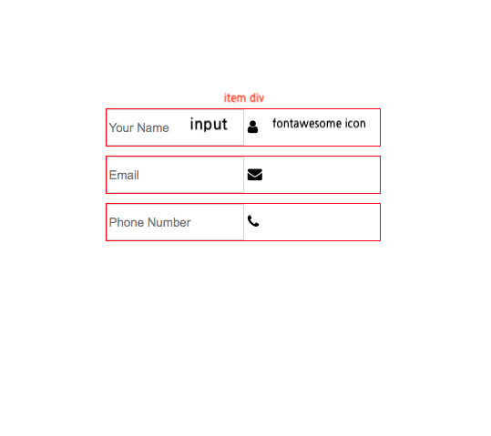
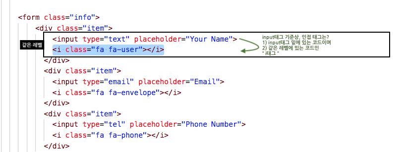

# Form 필드 애니메이션

## 1. preview
### hover, calc함수, 가상클래스nth-child, nth-of-type, background-position, before, after, input, label, id 사용
#### input에 마우스가 클릭됐을 때 사용되는 focus속성에 따라 디자인 변경하기 


## 2. 코드 분석

### 1) html
- `form`요소는 `before`, `after`요소를 사용 못함
- `position: absolute`을 사용해서 `before`, `after`처럼 만들어야함

```html
<body>
    <form class="info">
        <div class="item">
            <input type="text" placeholder="Your Name">
            <i class="fa fa-user"></i>
          </div>
          <div class="item">
            <input type="email" placeholder="Email">
            <i class="fa fa-envelope"></i>
          </div>
          <div class="item">
            <input type="tel" placeholder="Phone Number">
            <i class="fa fa-phone"></i>
          </div>
        <!-- item이 부모요소가 되어, fontawesome이 자식요소로서 left:0, top:0로 위치됨-->

    </form>
</body>
```

<br/><br/>

### 2) css

#### (1) 중앙정렬 및 필요한 기능 import하기

```css

/* Fontawesome 4.7 */
@import url('https://stackpath.bootstrapcdn.com/font-awesome/4.7.0/css/font-awesome.min.css');


/* 중앙정렬 */
body{
    display: flex;
    justify-content: center;
    align-items: center;
    height: 100vh;
}


```

<br/>

#### (2) input태그에 디자인 적용하기

- 아래 그림과 같이 `item`의 좌측에는 `icon`, 우측에는 `input`태그가 있도록 배치한다.



- `item`안에 있는 아이콘 요소의 위치를 고정시키기 위해 `position: relative`를 함

- `.item input`은 좌측에 아이콘 태그가 오기에 `padding-left`로 왼쪽 공간을 비워줌.


```css
.item{
    width: 300px;
    margin: 10px;
    position: relative;      /*자식요소 위치를 고정 목적*/
}

.item input[type=text],
.item input[type=tel],
.item input[type=email]{
    border : 1px solid lightgray;
    height: 40px;
    width: inherit;           /*부모따라 300px*/

    border-radius: 5px;
    padding: 10px;
    box-sizing: border-box;  /*padding한 만큼 박스 크기 늘어나지 않게 함 */

    padding-left: 50px;      /*좌측에 있는 아이콘만큼 피해서 input태그가 위치됨*/

    outline: none;           /*form태그 클릭시 외곽선이 변하는 거 -> 없앰*/
    transition: 0.3s;
    
}

```

<br/>
<br/>

#### (3) 아이콘의 위치 및 디자인 적용하기

- `.item .fa`는 아이콘 태그로, 부모 안에서 좌측에 위치하기 위해 `position: absolute`를 사용
- `top : 0`, `left : 0`를 해서 고정적으로 좌측에 위치하게 함
- `font-size: 20px`을 하면 아이콘의 크기 설정이 가능
- 자신의 높이값(`40px`)만큼 `line-height`를 주면 수직 중앙이 됨

```css
.item .fa{
    position: absolute;       /* 부모인 item가 relative, 자식인 fa태그의 위치를 고정적인 위치로 설정가능 
                               -> 제일 좌측에 위치하게 함(form태그는 before가상클래스를 못쓰니까) */
    top : 0;
    left : 0;
    
    color : #fff;
    background-color: gray;
    border-radius: 5px 0 0 5px;/*4개의 숫자를 적어주면 시계방향으로 적용됨 (왼쪽상단 오른쪽상 오른쩍하단, 왼쪽하단)*/
    font-size: 20px;           /*font-awesome 아이콘은 font로 취급-> font 크기를 줄이면 아이콘 크기가 줄어듬*/
    width: 40px;
    text-align: center;        /*아이콘 중앙정렬*/
    height: 40px;
    line-height: 40px;         /*수직 중앙정렬*/
    transition: 0.2s;

```

<br/>
<br/>

#### (4) input에 focus시 효과주기

- `.item input[type=text]:focus`는 input클릭시 input 자신을 어떻게 할 것인지 설정이 가능
- `focus`시 외곽선에 약간의 그림자와 외곽선 색 변화를 줌

```css

/* focus는 input태그에서만 사용가능 */
.item input[type=text]:focus,
.item input[type=tel]:focus,
.item input[type=email]:focus{
    border : 1px solid dodgerblue;
    box-shadow: 0 0 5px dodgerblue;
}

```

<br/>
<br/>

#### (5) input태그 클릭시 아이콘 색깔 변하게 하기 

- 인접선택자(`+`)를 이용하여 효과를 적용함
- 인접선택자는 코드상 아래에 있는, 동일 레벨의 선택자만 선택가능(`+`)
- 형제는`~`로 불러올 수 있음
- 아래 사진처럼 `input`포커스 됐을 때 `input`에 인접한 `.fa`클래스에 효과를 줄 수 있음



```css
.item input:focus + .fa{
    background-color : dodgerblue;     /*input을 focus할 시 아이콘 색깔 변경*/

}
```

<br/>
<br/>

#### (6) input focus됐을 때 placeholder없애기

- `.item input:focus::placeholder`은 `input`이 `focus`됐을 때, 자기자신`::`의 `placeholder`속성 설정 가능

```css

/* input이 focus됐을 때, 자기자신::의 placeholder속성을 이렇게 하겠다. */
.item input:focus::placeholder{
    visibility: hidden;
}
```


